# Perceptron

В данном проекте реализована простейшая искусственная нейронная сеть в виде перцептрона, которая должна обучается на открытом наборе данных и осуществляет распознавание 28 рукописных букв латинского алфавита.

- Перцептрон:  
  * имеет **от 2 до 5** скрытых слоев;
  * использует сигмоидальную функцию активации для каждого скрытого слоя;
  * обучается на открытом датасете с использованием метода обратного распространения ошибки;
  * отношение тестовой выборки к обучающей составляет *не больше 2:8*, т.е. тестовая выборка составляет не более 20% исходного датасета.

- Перцпетрон реализован *двумя* способами:  
  * в матричном виде (все слои представлены в виде матриц весов)
  * в графовом виде (каждый нейрон представляется в виде некоторого объекта)

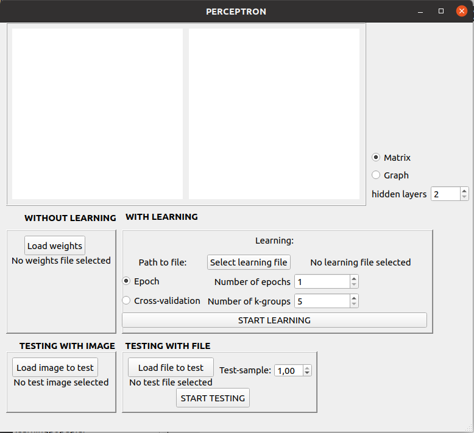

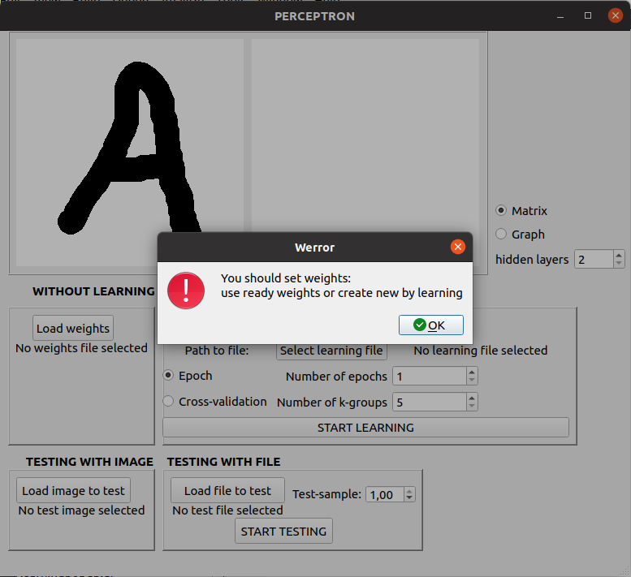

Для распознавания букв необходимо запустить процесс обучения или загрузить из файла веса перцептрона.  
Процесс обучения может быть:  
  * в реальном времени для заданного пользователем количества эпох;
  * с применением кросс-валидации для заданного числа групп _k_  
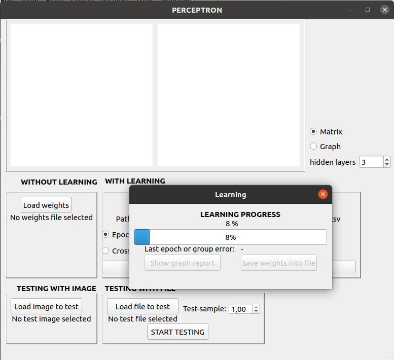

После завершения обучения можно вывести на экран контрольные значения ошибки для каждой эпохи обучения, сохранить веса перцептрона в файл  
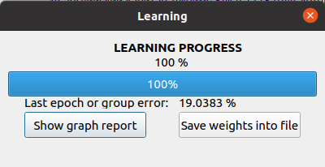

Отчет в виде графика изменения ошибки, посчитанной на тестовой выборке, для каждой эпохи обучения  
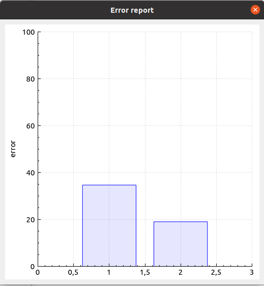

Рисуем двухцветные изображения от руки:  
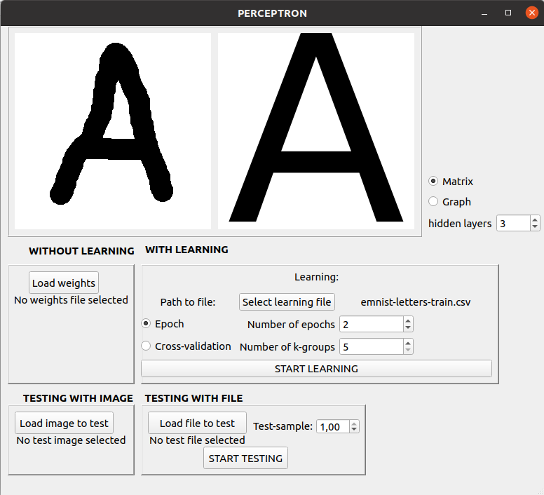

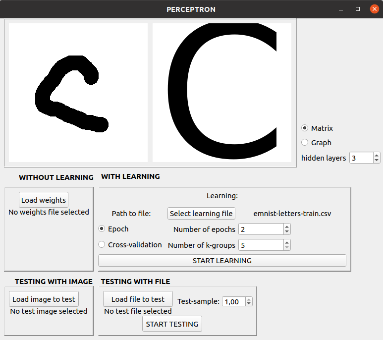

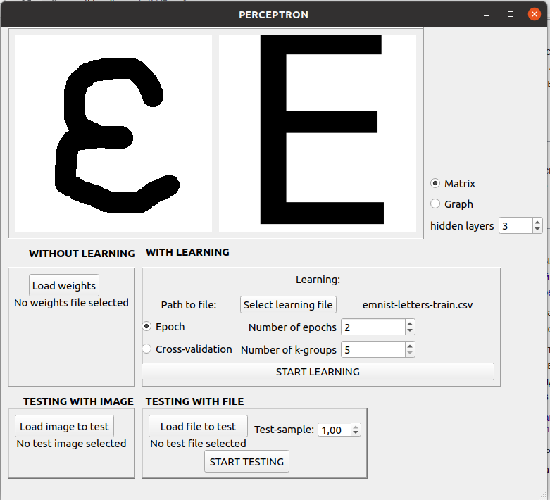

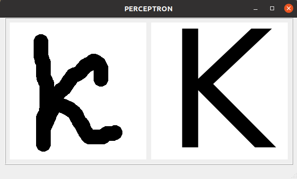

Как говорили ранее, есть возможность загрузить из файла веса перцептрона.  
Можно запустить эксперимент на тестовой выборке или ее части, задаваемой дробным числом от 0 до 1 (где 0 - это пустая выборка - вырожденная ситуация, а 1 - вся тестовая выборка целиком).  
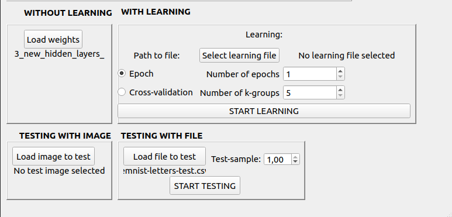

После выполнения эксперимента на экран выводится средняя точность (average accuracy), прецизионность (precision), полнота (recall), f-мера (f-measure) и общее затраченное время  
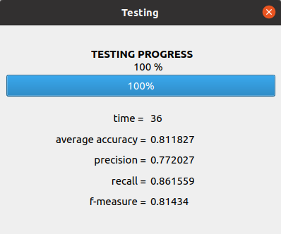

Также для классификации можно загрузить BMP-изображения с буквами латинского алфавита:  
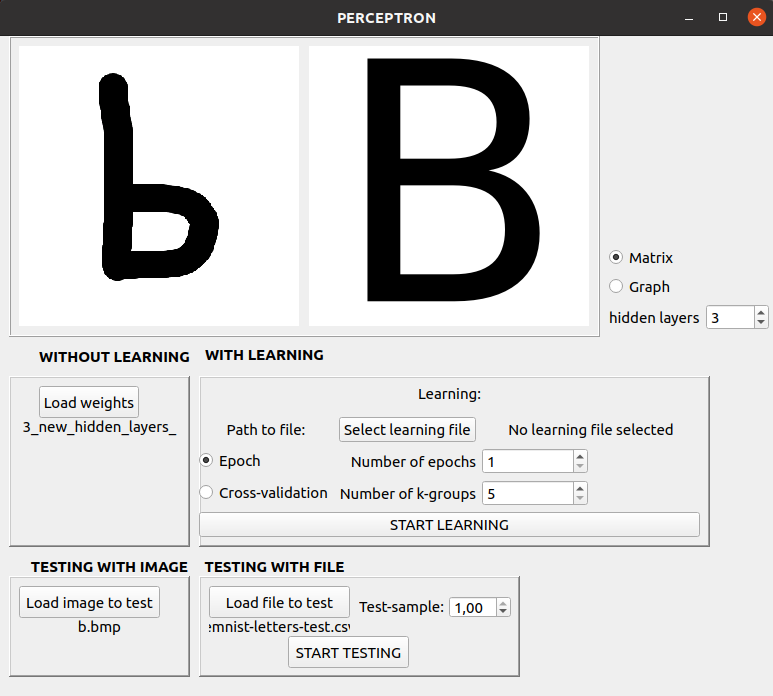   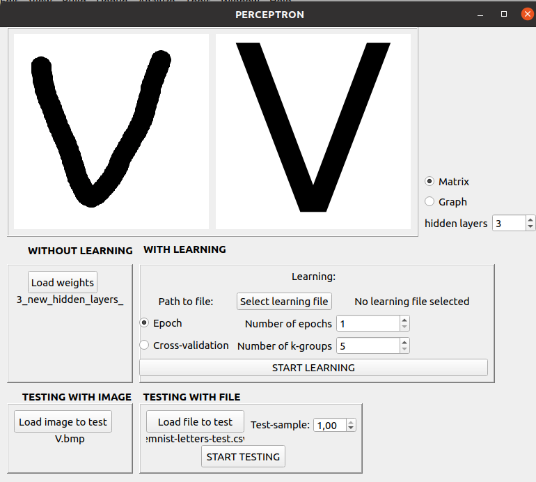

